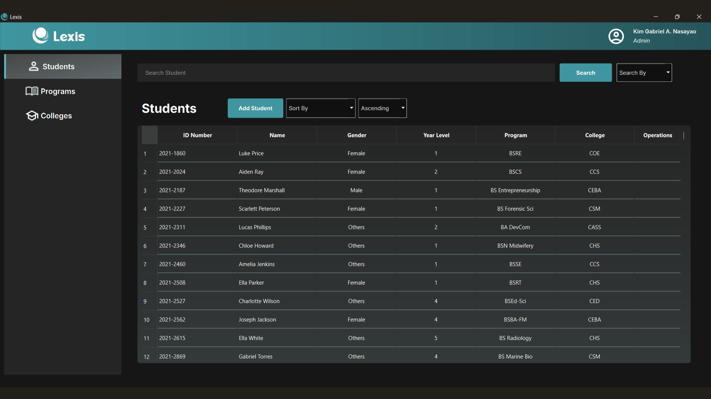
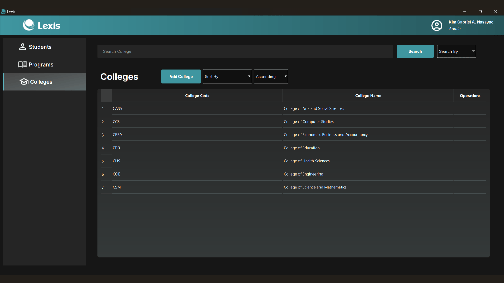
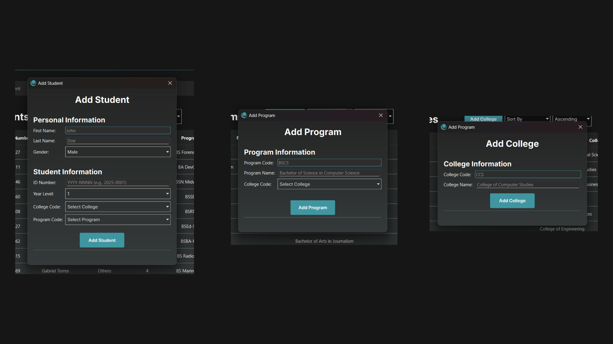
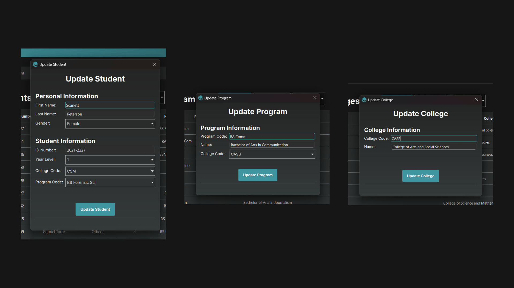
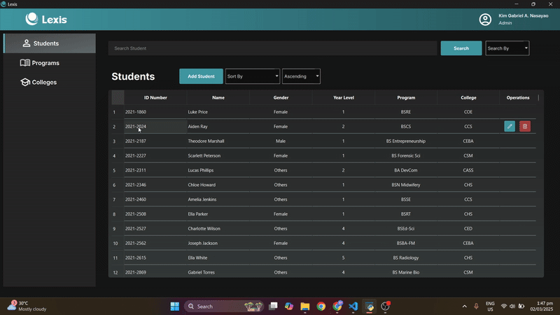
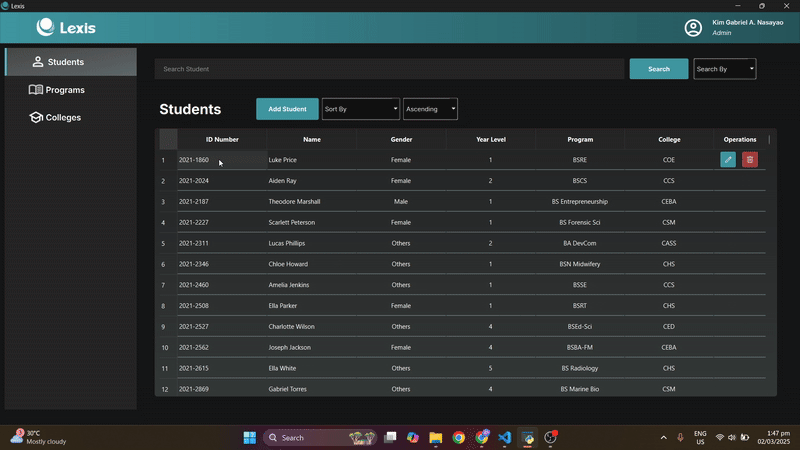

<h1>
  
  Lexis - a Student Information System
</h1>

This project is developed in fulfillment of the requirements for the subject **CCC151 - Information Management Systems**.

<br></br>
## About This Project

Lexis is a student information system built using Python, PyQt6, and using CSV data storage **without a DBMS**. It provides full CRUDL capabilities, including features such as **sorting**, **searching**, **unique ID management**, and **batch operations**.

<br></br>

## **Features**
- Store **STUDENT**, **PROGRAM**, and **COLLEGE** records for any University
- **ADD**, **EDIT**, and **DELETE** records
- **SORT** records by multiple fields 
- **SEARCH** with or without specifying field
- Intuitive **PyQt6** UI  
- **CSV**-based database (lightweight storage)
- **BATCH OPERATIONS** (batch updates and deletes)
- **UNIQUE ID** storage

<br></br>

#### STUDENTS PAGE


#### PROGRAMS PAGE


#### COLLEGES PAGE


#### ADDING RECORDS


#### UPDATING RECORDS


#### BATCH OPERATIONS




___

<br></br>

## **Added Updates**
- ✅ Refactor the table view to allow **multi-selection** of rows for **batch operations** (Batch deletions and edits)

## **Future Updates**
- 🔜 Add csv **importing** and **exporting**
- 🔜 Add **user authentication** and make operations **role-based**. (Admins can add new colleges, but regular users can only view, add, update, and delete student records.)
- 🔜 Add **pagination** to prevent gui loading lag
- 🔜Add a **dashboard** page to show program and college statistics and graphs
- 🔜Add an **executable** file to remove installation and setup process

<br></br>

## **Setup Instructions**

### **1. Clone the Repository**

```sh
git clone https://github.com/gabnash05/CCC151-SSIS.git
cd CCC151-SSIS
```
### **2. Create and Activate a Virtual Environment**
- **Windows Command Prompt:**
  ```sh
  python -m venv ssis_env
  ```
- **Linux/macOS:**
  ```sh
  source venv/bin/activate
  ```
You’ll see (venv) appear in the terminal, indicating that you're inside the virtual environment.

### **3. Activate the Virtual Environment**

- **Windows Command Prompt:**
  ```sh
  ssis_env\Scripts\activate
  ```

- **Windows Powershell:**
  ```sh
  .\ssis_env\Scripts\Activate
  ```

- **Linux/macOS:**
  ```sh
  source ssis_env/bin/activate
  ```

### **4. Install Dependencies**

```sh
pip install -e .
```
This installs all required dependencies including PyQt6 and any other libraries listed in `requirements.txt`
___

<br></br>

## **Running the Project**

Make sure the virtual environment is activated and all dependencies were installed properly
```sh
python -m main
```
<br></br>

## **Deactivating the Virtual Environment**

When you're done working, deactivate the virtual environment:
```sh
deactivate
```

<br></br>

## **Troubleshooting**

If `pip install -e .` fails, try manually installing dependencies using:
```sh
pip install -r requirements.txt
```

If `pip install -r requirements.txt` fails, try updating `pip`:
```sh
pip install --upgrade pip
```

<br></br>

## **License**
This project is for educational purposes only.